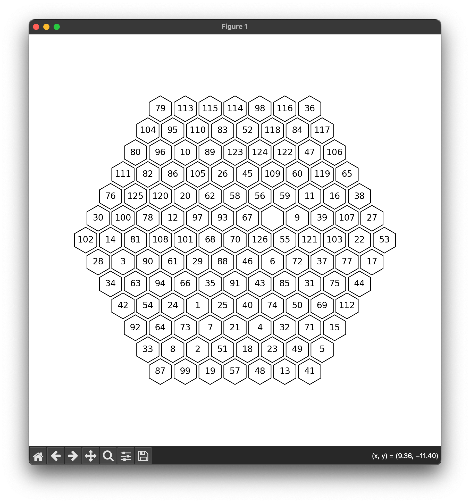

## azspcs flutter viz for hex grid

[Link to contest](http://azspcs.com/Contest/BaltosPuzzle/)



see also the [Flutter version](https://github.com/keyle/azspcs-flutterviz) version

```
pipenv shell
python visu.py puzzles/3
```

or 

```
pipenv run python visu.py puzzles/19
```
